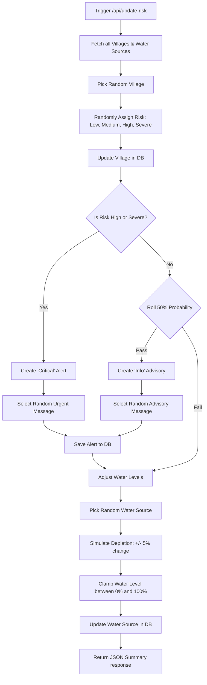

# AI Early Warning & Simulation System

OGAAL integrates a predictive model and automated alert dispatcher to act as a **Drought Early Warning System**. This framework leverages real-time reports, simulated weather parameters, and water levels to calculate drought risk and dispatch critical advisories before water points fail.

---

## 1. Predictive Risk Engine

The early warning engine operates on a multi-layered scoring matrix:

### Input Parameters
*   **Sensor Readings**: Live telemetry from water points (soil moisture, temperature, humidity, water level).
*   **Crowdsourced Reports**: USSD and field agent reports detailing drops in water levels or structural damages.
*   **Historical Trends**: Depletion rates of water resources in matching villages during dry seasons (Jilaal/Hagaa).

### Scoring Matrix

Risk levels are dynamically calculated and updated on a per-village basis using an algorithmic simulation of environmental parameters:

| Risk Level | Drought Probability Range | Critical Actions & System Triggers |
| :--- | :--- | :--- |
| **Low** | $0.0\% - 25.0\%$ | • Groundwater levels are stable. • Generate general weather and conservation advisories. |
| **Medium** | $25.1\% - 50.0\%$ | • Prepare catchment systems. • Monitor depletion trends. |
| **High** | $50.1\% - 80.0\%$ | • Automated critical alert generation. • Initiate village-level water rationing. • Notify local water committees via SMS. |
| **Severe** | $80.1\% - 100.0\%$ | • High-priority alerts generated. • Auto-dispatch alerts to NGO and MOWRD portals. • Direct SMS warning broadcasts to remote numbers. |

---

## 2. Dynamic Simulation Endpoint

The predictive model is driven by an AI simulator endpoint:
*   **Endpoint**: `POST /api/update-risk`
*   **Description**: Simulates shifting weather patterns, sensor readings, and water depletion rates across randomly selected villages.

### Simulation Logic Flow

### Generated Messages & Advisories

Depending on the risk level generated during the simulation, OGAAL automatically dispatches customized advisories:

#### Critical Alerts (High/Severe)
*   *"Drought Risk escalated to Severe. Immediate water rationing required."*
*   *"AI Prediction: Water tables dropping rapidly in [Village Name]."*
*   *"Urgent: High drought conditions detected."*

#### Informational Advisories (Low/Medium)
*   *"AI Advisory: Predicted rainfall in 3 days. Prepare catchment systems."*
*   *"AI Advisory: Water usage optimization recommended."*
*   *"AI Advisory: Groundwater levels stable."*

---

## 3. Real-Time SMS Dispatch

When a high or severe risk event is registered:
1.  **Immediate Log Creation**: A database `Alert` record is generated with a `Critical` severity flag.
2.  **Dashboard Broadcaster**: The Web Portal receives the warning via real-time hooks, rendering red hazard zones on the map.
3.  **Telesom Integration**: If connected to field monitors, a unicode warning message is broadcasted to alert remote community members immediately.
