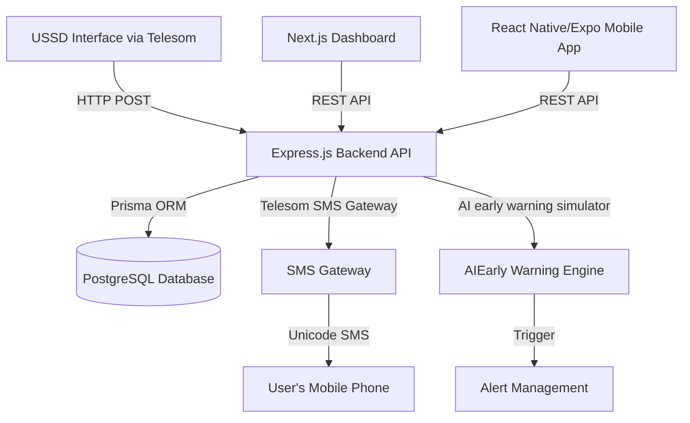
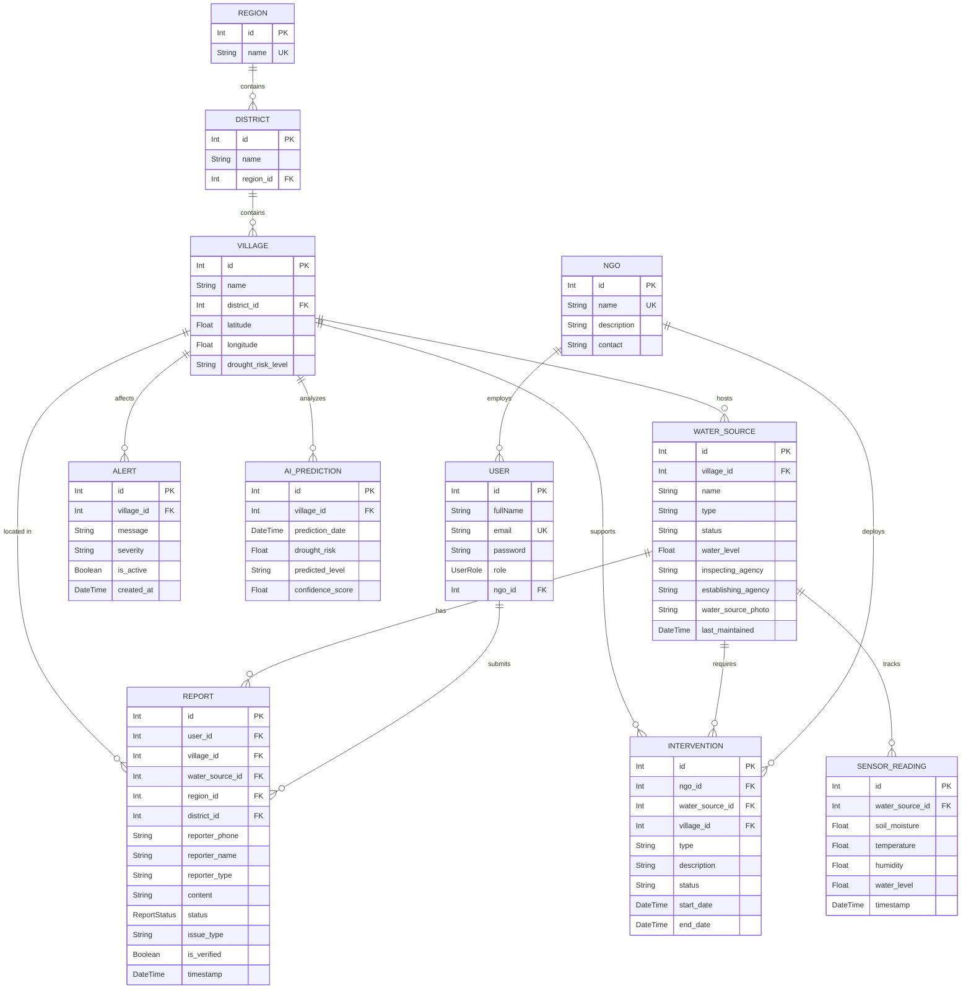

# System Architecture & Database Design

The **OGAAL Platform** (Somali for *Aware* or *Informed*) is a comprehensive, multi-channel water resources monitoring and early warning system designed for Somaliland. By leveraging modern web, mobile, and USSD interfaces, OGAAL bridges the gap between offline communities, field workers, government officials, and NGOs.

---

## 1. System Overview

OGAAL is designed with a decoupled, modular monorepo architecture:

### Component Breakdown
*   **Backend (Express + TypeScript + Prisma)**: The central brain of the platform. Exposes clean REST API endpoints for the dashboard and mobile app, processes live USSD sessions from telecom gateways, executes AI risk early-warnings, and triggers real-time SMS broadcasts.
*   **Web Portal (Next.js 15 + TailwindCSS + Lucide)**: An administrative dashboard used by the Somaliland Ministry of Water Resources Development (MOWRD), NGOs, and administrative teams to track water point statuses, manage relief interventions, view analytics, and respond to community reports.
*   **Mobile App (React Native + Expo)**: Used by field inspectors and local community leaders to check local water points, submit detailed verified reports, upload site photos, and view regional drought statuses offline or online.
*   **USSD Interface (Express)**: An offline channel designed for remote community members to check local water points and report issues using simple GSM feature phones, working in complete harmony with the **Telesom SMS Gateway**.

---

## 2. Database Schema (Prisma)

The PostgreSQL database schema is structured around location hierarchies, water sources, report states, and analytical models:

### Enumeration Models
1.  **User Roles (`UserRole`)**:
    *   `ADMIN`: Full platform configuration and user management.
    *   `GOVERNMENT`: Somaliland MOWRD personnel with view-only or verification access.
    *   `NGO_WORKER`: Relief agency staff tracking and adding interventions.
    *   `COMMUNITY_MEMBER`: Field agents and localized monitors.
2.  **Report Statuses (`ReportStatus`)**:
    *   `WORKING`: Water source is fully operational.
    *   `BROKEN`: Pump, generator, or pipe structure is damaged.
    *   `DRY`: The water source has completely run dry.
    *   `LOW_WATER`: Water table is dropping rapidly.
    *   `CONTAMINATION`: Water quality has degraded or become unsafe.

---

## 3. Location Hierarchy

All operations in OGAAL drill down using Somaliland's administrative hierarchy:
$$\text{Region} \rightarrow \text{District} \rightarrow \text{Village} \rightarrow \text{Water Source}$$

*   **SWIMS Alignment**: The database maps regions into six key Somaliland administrative zones imported directly from MOWRD SWIMS datasets:
    1.  **Awdal**
    2.  **Maroodi Jeex** (mapped from Hargeisa/Gebiley)
    3.  **Saaxil** (mapped from Berbera)
    4.  **Togdheer**
    5.  **Sanaag**
    6.  **Sool**

---

## 4. Key Integrations
1.  **Telesom USSD Channel**: Receives session traffic from Telesom mobile gateways and decodes paginated choices dynamically.
2.  **Telesom SMS REST Client**: Sends automated unicode alerts using MD5 salted dynamic authorization headers:
    $$\text{authKey} = \text{MD5}(\text{username} + \text{password} + \text{YYYY-MM-DD})$$
3.  **SWIMS Dataset Importer**: Imports clean CSV records matching historical water source coordinates, maintaining data integrity by pruning, mapping, and linking location dependencies automatically.
