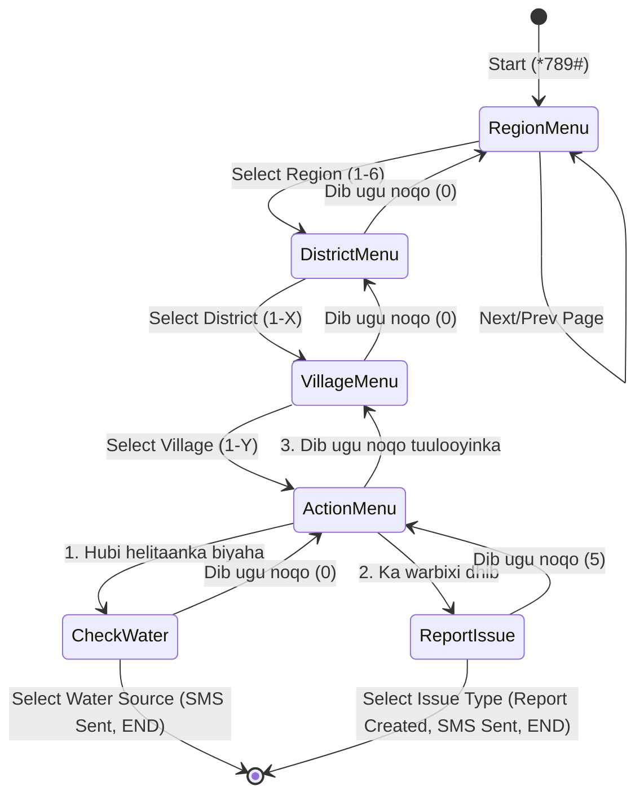

# USSD & SMS Gateway Integration

## 1. Telesom USSD Gateway API

When a user dials the USSD code (e.g. `*789#`), the telecom gateway (Telesom) handles the GSM session and translates key inputs into standard HTTP POST requests forwarded directly to the OGAAL server.

*   **Endpoint**: `POST /api/ussd`
*   **Payload Format (Forwarded from telecom gateway)**:
    ```json
    {
      "sessionId": "ATUi_3092a83210bc93847291a182",
      "serviceCode": "*789#",
      "phoneNumber": "+252634444444",
      "text": ""
    }
    ```
    *   `sessionId`: A unique string that identifies the user's active session.
    *   `phoneNumber`: The MSISDN (mobile number) of the user making the call.
    *   `text`: Contains the history of all keyboard selections separating key inputs by asterisks `*` (e.g. `"1*2*4"` represents selecting the first item, then the second, then the fourth).

*   **Response Format**:
    ```json
    {
      "message": "Kusoo dhawoow Ogaal\nDooro Gobol:\n1. Awdal\n2. Maroodi Jeex\n...",
      "type": "CON"
    }
    ```
    *   `type = "CON"`: Tells the telecom gateway to display the message and keep the input screen open for user input.
    *   `type = "END"`: Tells the gateway to display the message and terminate the GSM connection immediately.

---

## 2. Paginated USSD Menus

Because USSD menus are limited to **160 characters** per request, returning massive lists of districts or villages in a single screen can result in character overflow and session crashes.

OGAAL solves this using a **Custom Paginated Menu Helper** (`getPaginatedUssdMenu`) which limits lists to **10 items per page** and handles forward/backward navigation commands:

### Somali Menu Navigation Elements
*   `Next (Page X)`: Appends an option to jump to the next page.
*   `Previous (Page X)`: Appends an option to jump to the previous page.
*   `0. Dib ugu noqo`: Re-queries the parent list or main menu.

---

## 3. Somali-Localized Navigation Flow

The entire USSD tree is fully localized in Somali:



### Action 1: Checking Water Availability (`1. Hubi helitaanka biyaha`)
1.  Lists all water sources registered in the selected village.
2.  Selecting a source displays its status, type, and agency inspection in Somali:
    *   **Working**: *"Wuu shaqeynayaa, biyo leh"*
    *   **Broken**: *"Jaban"*
    *   **Dry**: *"Qalalan"*
    *   **Low Water**: *"Biyo yar"*
    *   **Contaminated**: *"Wasakh"*
3.  Terminates the session (`END`) and dispatches a detailed status summary directly to the user's mobile number via SMS.

### Action 2: Reporting an Issue (`2. Ka warbixi dhib`)
Allows users to choose from 4 preset issues:
1.  `Biyihii dhammaaday` (Water dried up) $\rightarrow$ creates a `DRY` status report.
2.  `Ceelkaa jabay` (Well broken) $\rightarrow$ creates a `BROKEN` status report.
3.  `Biyo qashan` (Contaminated water) $\rightarrow$ creates a `CONTAMINATED` status report.
4.  `Dhib kale` (Other issues) $\rightarrow$ creates an `UNKNOWN` status report.

Upon selection, OGAAL immediately:
*   Creates an unverified community `Report` with the user's phone number as the reporter handle.
*   Pushes an SMS receipt: *"Warbixintaada waa la helay. Mahadsanid! - OGAAL"*.

---

## 4. Telesom SMS REST Gateway Integration

The OGAAL backend implements the precise **MD5 security signing** required by Telesom's enterprise SMS API (`https://sms.mytelesom.com`).

### Dynamic Key Authorization
To prevent replay attacks and authenticate requests, Telesom requires a dynamic header `X-Auth-Key` built from a salted MD5 hash of the username, password, and current server date:

$$\text{authKey} = \text{MD5}(\text{TELESOM\_USERNAME} + \text{TELESOM\_PASSWORD} + \text{YYYY-MM-DD})$$

### Node.js Implementation Example

```typescript
import crypto from "crypto";
import axios from "axios";

const sendSMS = async (to: string, message: string) => {
  const username = process.env.TELESOM_USERNAME!;
  const password = process.env.TELESOM_PASSWORD!;
  const clientRef = process.env.TELESOM_CLIENT_REF || 'TLS-191';
  
  // Format Date: YYYY-MM-DD
  const today = new Date();
  const timestamp = today.toISOString().split('T')[0];

  // Hash: username + password + date
  const authKey = crypto
    .createHash('md5')
    .update(username + password + timestamp)
    .digest('hex');

  const payload = {
    to: [to],
    message,
    type: 'unicode', // Required for Somali special characters if needed
    client_ref: clientRef
  };

  const headers = {
    'Content-Type': 'application/json',
    'SenderID': process.env.TELESOM_SENDER_ID || 'Ogaal1',
    'X-Auth-Key': authKey
  };

  return axios.post('https://sms.mytelesom.com/index.php/smsapi/v1/messages', payload, { headers });
};
```
